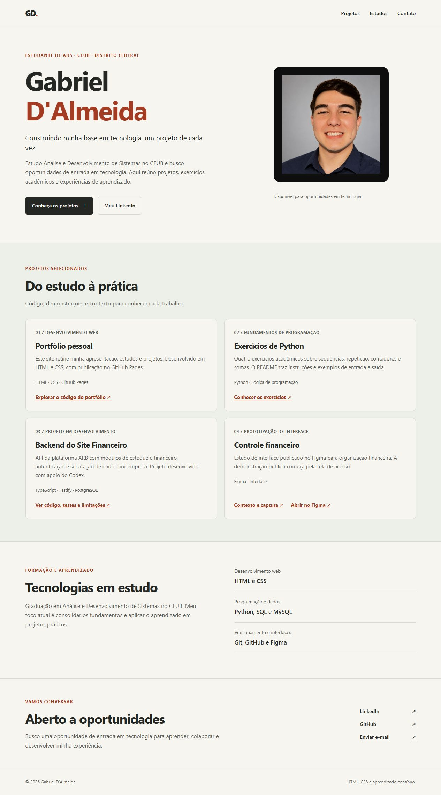

# Portfólio de Gabriel D'Almeida

Página pessoal em HTML e CSS para apresentar minha formação em Análise e Desenvolvimento de Sistemas no CEUB, tecnologias em estudo e projetos.

**[Acessar o portfólio publicado](https://gabrieldalmeida0.github.io/portfolio/)** · [LinkedIn](https://www.linkedin.com/in/gabriel-d-almeida-02ba99199/)



## O que você encontra

- Apresentação e contatos profissionais.
- Projetos com links para código e demonstrações.
- Tecnologias em estudo, sem atribuição de nível de domínio.
- Layout adaptável, navegação por teclado e respeito à preferência por movimento reduzido.

## Executar localmente

Não há dependências, etapa de compilação ou JavaScript.

```bash
git clone https://github.com/gabrieldalmeida0/portfolio.git
cd portfolio
```

Abra `index.html` no navegador. Se preferir servir por HTTP, com Python 3 instalado:

```bash
python -m http.server 8000 --bind 127.0.0.1
```

Acesse `http://127.0.0.1:8000`. Encerre o servidor com `Ctrl+C`.

## Estrutura

```text
index.html           Conteúdo, navegação e metadados
assets/styles.css    Estilos e adaptação para telas menores
assets/gabriel.jpg   Foto usada na apresentação
assets/favicon.svg   Ícone do site
docs/                Captura real da página
```

## Projetos apresentados

- [Exercícios de Python](https://github.com/gabrieldalmeida0/python-exercises): fundamentos de programação.
- [Backend do Site Financeiro](https://github.com/gabrieldalmeida0/arb-finance-backend): projeto em desenvolvimento com apoio do Codex.
- [Controle financeiro no Figma](https://github.com/gabrieldalmeida0/finance-tracker-ui): prototipação de interface.

## Publicação e manutenção

O site é publicado no GitHub Pages. HTML, CSS e imagens são arquivos estáticos. Após uma alteração, confira os links, o carregamento da foto, a navegação por teclado e o layout em telas de 320 px e desktop.

O site inclui descrição, URL canônica e metadados de compartilhamento. A aparência da prévia pode variar conforme a plataforma e seu cache.
